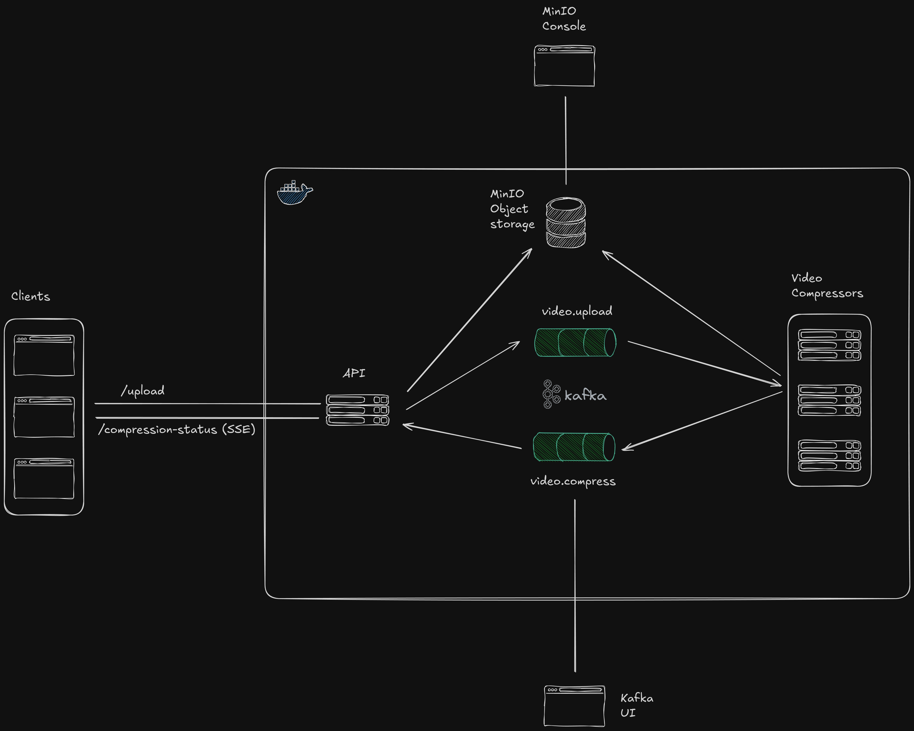

# Distributed Video Compression Service

I built a small project on the weekend to better understand why **Event-Driven Architecture (EDA)** is necessary for software at scale.

The project is a dsitributed video compression service built using **Publish/Subscribe (Pub/Sub)** messaging pattern.



## Technologies

1. **Python (Flask)**: Backend service to handle video uploads and manage compression jobs.
2. **Kafka**: Message broker implementing the Pub/Sub pattern for managing video compression jobs and communication.
3. **Docker**: Containerized services for easy deployment and scalability.
4. **ffmpeg**: Video compression and processing.
5. **MinIO**: Object storage for uploaded and processed videos.

## Features

- **Event-Driven Architecture (EDA)**: Uses Kafka to decouple video upload and compression processes.
- **Publish/Subscribe Pattern (Pub/Sub)**: Video uploads trigger compression tasks, which are distributed across workers.
- **Real-time Updates**: Clients receive live compression status updates using Server-Sent Events (SSE).
- **Scalability**: Parallel video compression for different resolutions using multiple workers, and the ability to customize the scale, for eg, a custom VM configuration for each resolution, or based on load (Some resolutions aren't yet mainstream such as from 8k to 4k).

## Setup and Usage

### 1. Configure Environment Variables

Set up the necessary environment variables for the backend and video compressor services:

```bash
cp ./backend/.env.example ./backend/.env
```

```bash
cp ./video-compressor/.env.example ./video-compressor/.env
```

```bash
cp ./frontend/.env.example ./frontend/.env
```

### 2. Run the Containers

Start the system using Docker Compose:

```bash
docker compose up -d
```

Alternatively, you can use the `make` command:

```bash
make u
```

### 3. Upload Videos

- Access the React frontend at [http://localhost:80](http://localhost:80).
- Upload videos through the frontend.
- Monitor compression progress in real time.

### 4. Future improvements

1. So far the compression tasks are handled sequentially as I haven't figured out how to eliminate race conditions when using `ProcessPoolExecutor`.
2. The compression status endpoint needs further improvement to a proper notification system, as it now uses a simple python dictionary.
3. To ensure URL safety, for now i'm only using `uuid` for the `filename`, there's probably a better practice to implement here.
4. `ffmpeg` supports GPU acceleration, and with docker supporting gpu access to images, it can be further optimized.
5. Environment variables need to be secured using either a managed solution, or docker secrets.
